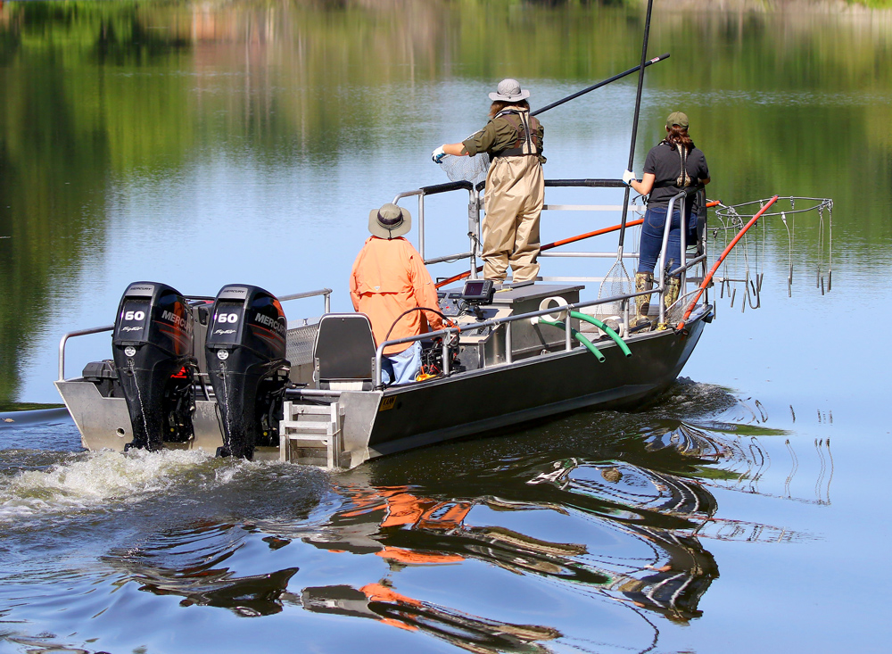

[Course Overview](index.md) \> General linear mixed models

# General linear mixed models: data from electrofishing surveys

In this second module of the course we will repeat the basic concepts of linear model fitting. The course will then introduce the concept of mixed linear models, fixed and random variables and how they should be selected and treated. The example data set uses catches from bitterling electrofishing surveys in South Moravia (1995-1998).

## Data and scripts

The [**R script**](Bitterling1.R) and the example [**dataset**](bitterling.csv). You can also access all the scripts and datasets from the course [GitHub page](https://github.com/fishsizeproject/CPUEcourse).

## Slides and video

The tutorial [**video**](https://youtu.be/Iw1LlytvOoA) from the online meeting: lecture, R script presentation and the day 1 discussion. 

And you can also download [**slides**](slides/cpueD1P2.pdf) from this lecture. 

## Further resources

Links to further resources will be added here.

 
