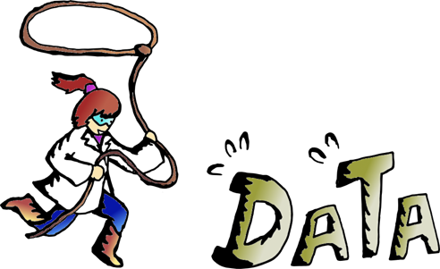
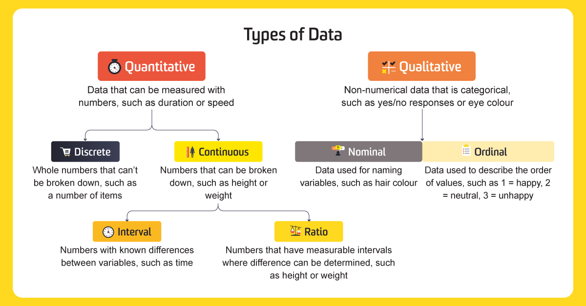
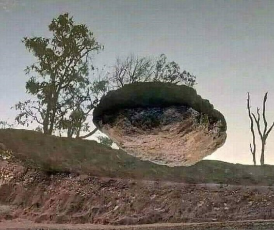
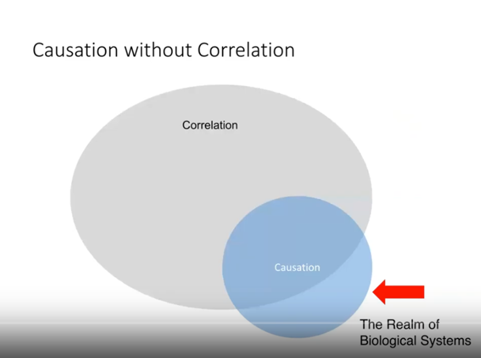
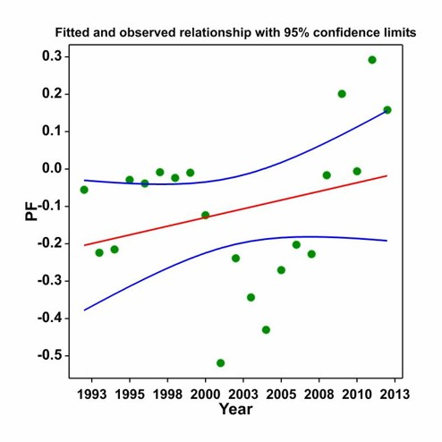

[Course Overview](index.md) \> Data exploration course materials

<h1 style="text-align:center;">

Exploring, cleaning & filtering data prior to analysis

</h1>

This course provides further introduction and discussion about
data exploration. This course is not directly related to the CPUE
standardisation course and can be done with or without completing
the previous course. The data exploration course has been prepared and
contributed by **Dr Harry Gorfine**, fisheries biologist at Nature Research
Centre, Lithuania and Victorian Fisheries Authority, Australia. The
course provides a general overview of data exploration challenges and
good practices and is intended to be followed independently.

# Slides

Here you can download course [slides](./slides/dataExploration.pdf).

# Recorded lectures

## Lecture 1: Introduction to data wrangling training module

## Lecture 2: Types of data & their characteristics

## Lecture 3: Exploratory data analysis

## Lecture 4: Correlation and dynamics issues

## Lecture 5: Examples of issues with treatment of data series

 

These courses are organised as a part of the ["Sustainable inland
fisheries"](https://en.sif.lt/home%20--%20EN/) project, funded by the
European Regional Development Fund (project No 01.2.2-LMT-K-718-02-0006)
under grant agreement with the Research Council of Lithuania (LMTLT).

 

