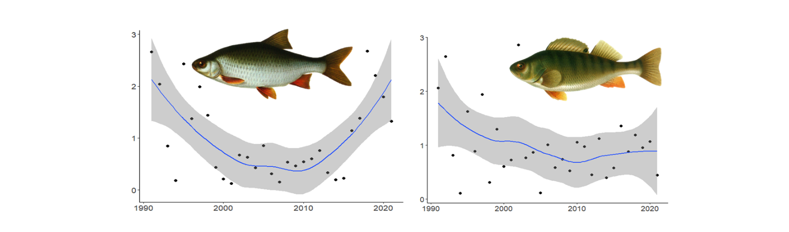
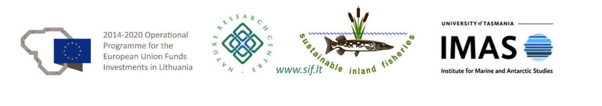

<h1 style="text-align:center;">

Course 1: Catch per unit effort data standardisation in R for fisheries
biologists and practitioners

</h1>

This short course is aimed at introducing researchers to fisheries data
analysis using linear models (LM), generalized linear models (GLM) and
generalized linear mixed models (GLMM) in the R working environment.
Scientific monitoring and artisanal, commercial or recreational fish
catch data is often used to assess population status, but such data are
usually complex and require careful standardisation.

**By the end of the course, participants should be able to:**

-   Undertake data exploration to avoid common pitfalls in tackling a
    data analysis

-   Recognise data structures and fit appropriate models to CPUE data

-   Understand and apply alternative approaches to model selection

-   Interpret and present the results of statistical models

The sessions during November 23-24, 2022 will be a blend of interactive
demonstrations, lectures and Q&A time. All materials delivered during
the course - including lecture videos, R scripts and resources - will be
freely available on this website for future use and independent
learning.

The course GitHub page has a [**discussion
group**](https://github.com/fishsizeproject/CPUEcourse/discussions)
where you can share your challenges and solutions about R and package
installations, statistics or other related topics. You will need a
GitHub account to post on this discussion group, but creating a GitHub
account is easy and useful anyway.

The course is led by Dr Carl Smith (Nature Research Centre, Lithuania
and University of Lodz, Poland) with an extensive expertise in
statistical analyses and teaching. The course is organised by Dr Asta
Audzijonyte (Nature Research Centre, Lithuania & University of Tasmania,
Australia). Additional technical support is provided Dr Catarina Silva
(Nature Research Centre) and Dr Eglė Jakubavičiūtė (Nature Research
Centre).

## Course content

Part 1 - [**Introduction and preparation**](1-introduction.md)

Part 2 - [**Fitting linear models**](2-trout.md)

Part 3 - [**General linear mixed models**](3-bitterling.md)

Part 4 - [**Zero inflated general linear mixed models**](4-hilsha.md)

Part 5 - [**Time series analysis and Bayesian inference**](5-zander.md)

## Feedback

If you completed the course, we greatly appreciate your
[**feedback**](https://docs.google.com/forms/d/e/1FAIpQLSeO6ymBEqQ747oGzg9ZI8NswbKbIsvf64i5-XmLHC6xP8AuMg/viewform?usp=sf_link)
to help us improve and plan further potential courses. If you would like
to stay informed and have not registered yet, you can fill in this
[**registration
form**](https://docs.google.com/forms/d/e/1FAIpQLSehWbFhzKt_WYETHsX73Kph9Iw__a8DaaZbf6z_ZZq6rBwvqg/viewform?usp=sf_link)
so that we have your contact details.

 

<h1 style="text-align:center;">

Course 2: Further points on exploring, cleaning & filtering data prior
to analysis

</h1>

This auxilary course provides further introduction and discussion about
data exploration. This course is not directly related to the CPUE
standardisation course above and can be done with or without completing
the previous course. The data exploration course has been prepared and
contributed by **Dr Harry Gorfine**, fisheries biologist at Nature Research
Centre, Lithuania and Victorian Fisheries Authority, Australia. The
course provides a general overview of data exploration challenges and
good practices and is intended to be followed independently.

[**Data exploration course materials**](data_exploration.md)

 

These courses are organised as a part of the ["Sustainable inland
fisheries"](https://en.sif.lt/home%20--%20EN/) project, funded by the
European Regional Development Fund (project No 01.2.2-LMT-K-718-02-0006)
under grant agreement with the Research Council of Lithuania (LMTLT).

 

<b>Pew Fellows Program in Marine Conservation </b> at

<b> The Pew Charitable Trusts </b>

